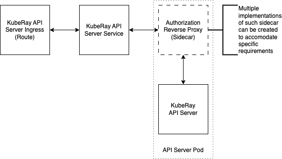

<!-- markdownlint-disable MD013 -->
# Setup API Server with Security

Currently, the KubeRay API server deployed on a publicly accessible cluster is directly exposed to the internet with no authentication/authorization. To protect its endpoint we need to introduce security.
The solution is based on the architecture below:



It basically adds Authorization sidecar to the KubeRay API server pod. This architecture is extremely flexible and allows users to plug sidecar implementations that adhere to their security requirements, that can differ significantly across multiple organizations.

Here we will use a very simple [sidecar implementation](../experimental/cmd/main.go) with
a reverse proxy using token based authorization. This is a very simple authorization based
on the string token, shared between proxy and client. This implementation is not meant for
production, but rather as a demonstration. Additional examples of reverse proxy
implementation can be found [here](https://github.com/blublinsky/auth-reverse-proxy).
There is also a wealth of open source implementations, for example,
[oauth2-proxy](https://github.com/oauth2-proxy/oauth2-proxy) and many commercial
offerings.

## Basic token-based authentication reverse proxy

A simple token-based authentication reverse proxy [implementation](../experimental/cmd/main.go) is provided in the project along with make targets to build a docker image for it and push this image to the image repository. There is also a pre-build image `kuberay/security-proxy:nightly` that you can use for experimenting with security.

## Installation

### Set `security.proxy.tag`

Before any installation, please set `security.proxy.tag` to `latest` in
[values.yaml](../helm-chart/kuberay-apiserver/values.yaml) file.

Note that in this `values.yaml` file, there is a security configuration:

```yaml
security:
  proxy:
    repository: kuberay/security-proxy
    tag: nightly
    pullPolicy: IfNotPresent
  env:
    HTTP_LOCAL_PORT: 8988
    GRPC_LOCAL_PORT: 8987
    SECURITY_TOKEN: "12345"
    SECURITY_PREFIX: "/"
    ENABLE_GRPC: "true"
```

Removing this section will run API server without security.

### Deploy KubeRay operator and API server with security

Setting up kind cluster with all required things can be done using the following command:

```sh
make cluster operator-image docker-image security-proxy-image cluster load-operator-image load-image load-security-proxy-image deploy-operator deploy
```

Alternatively, to install only the API server with security configuration, you can use the
following helm command:

```sh
# Navigate to helm-chart/ directory if haven't
cd helm-chart
helm install apiserver kuberay-apiserver
```

## Example

Once the API server is installed, execute the following command:

```shell
curl --silent -X POST 'localhost:31888/apis/v1/namespaces/default/compute_templates' \
--header 'Content-Type: application/json' \
--data '{
  "name": "default-template",
  "namespace": "default",
  "cpu": 2,
  "memory": 4
}'
```

This fails with result `Unauthorised`. To make it work we need to add an authorization
header to the request:

```shell
curl --silent -X POST 'localhost:31888/apis/v1/namespaces/default/compute_templates' \
--header 'Content-Type: application/json' \
--header 'Authorization: 12345' \
--data '{
  "name": "default-template",
  "namespace": "default",
  "cpu": 2,
  "memory": 4
}'
```

### Clean up

```sh
make clean-cluster
# Remove apiserver from helm
helm uninstall kuberay-apiserver
```
